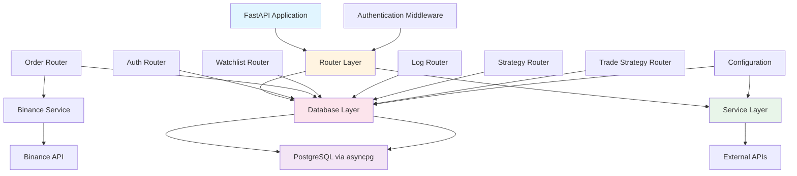
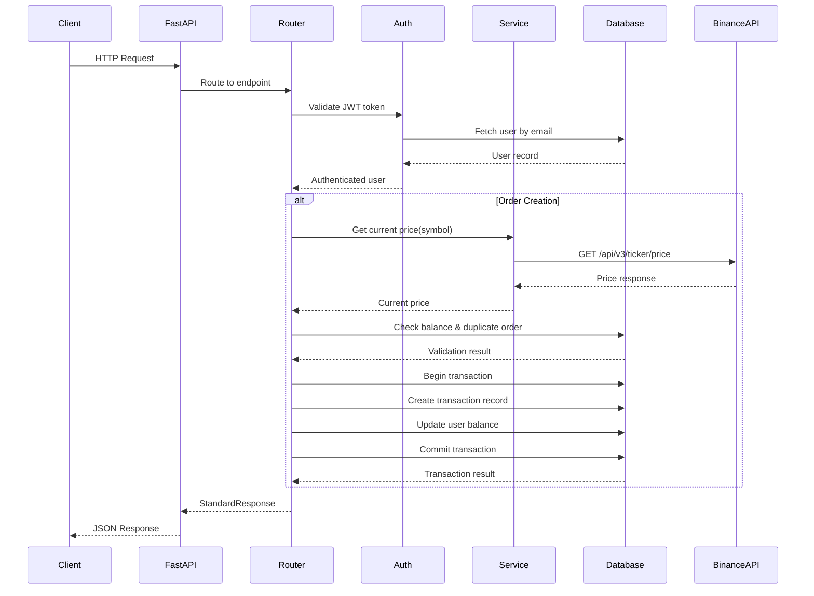
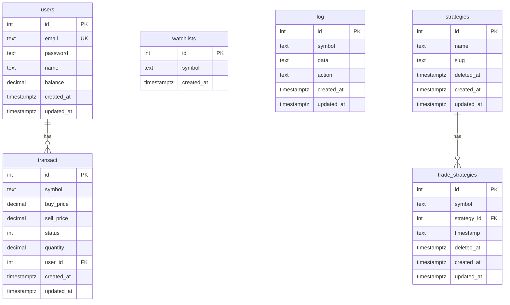

# Design: Initial Migrations - PHP Binance Sandbox to Python FastAPI

## Overview

This design document outlines the technical architecture for migrating the PHP Laravel-based Binance Sandbox application to Python FastAPI. The migration preserves all existing functionality while providing a Python-native codebase that supports seamless integration with numpy and pandas for research team workflows.

The migration encompasses:
- **Database Schema Migration**: 6 new tables (users extended, transact, watchlists, log, strategies, trade_strategies)
- **Binance API Integration**: Real-time market price fetching with testnet/production support
- **Order Management**: Buy/sell order creation and closing with atomic transactions
- **Trading Features**: Watchlist management, logging system, strategy management
- **Data Access Layer**: Structured DAO pattern for organized query functions with pandas DataFrame conversion helpers

The design builds upon the existing FastAPI architecture, extending the authentication system, database layer, and router patterns already established in the codebase.

## Steering Document Alignment

### Technical Standards (tech.md)

The design adheres to all documented technical standards:

**Database Access:**
- Uses `asyncpg` directly (no ORM) for maximum performance
- Maintains existing connection pool pattern (`get_db_pool()` with min_size=5, max_size=20)
- Uses parameterized queries (`$1`, `$2`, etc.) for SQL injection prevention
- Implements database transactions using `async with connection.transaction():` for atomicity

**Async Architecture:**
- All I/O operations use `async/await` patterns
- Database operations fully async via asyncpg
- External API calls use async HTTP client (httpx.AsyncClient)
- FastAPI endpoints are async functions

**Authentication:**
- Reuses existing JWT-based authentication system (`get_current_user` dependency)
- All trading endpoints require authentication via `Depends(get_current_user)`
- Token validation follows existing patterns in `app/core/security.py`

**Response Format:**
- All endpoints use `StandardResponse[DataT]` envelope for consistency
- Error responses use `HTTPException` with appropriate status codes
- Response models use `response_model_exclude_none=True`

**Configuration:**
- Extends `app/core/config.py` Settings class with Binance API configuration
- Uses `pydantic-settings` for type-safe environment variable management
- Maintains `.env` file pattern for local development

### Project Structure (structure.md)

The implementation follows established project organization conventions:

**Router Organization:**
- New routers in `app/routers/` following feature-based organization
- Routers use `APIRouter` with appropriate prefixes and tags
- Routers mounted in `app/main.py` using `app.include_router()`

**Database Layer:**
- Database functions organized in `app/db/database.py` (extending existing file)
- Structured DAO pattern: functions grouped by table/domain
- Helper functions for pandas DataFrame conversion

**Schema Organization:**
- New Pydantic models in `app/schemas/` organized by domain
- Request/response models follow existing patterns (UserCreate, UserResponse, etc.)
- All schemas use Pydantic v2 features (model_validate, model_dump, ConfigDict)

**Service Layer:**
- New `app/services/` directory for external API integrations
- `app/services/binance.py` for Binance API client
- Service layer follows async patterns and error handling conventions

**Database Initialization:**
- Extends `init_db()` function in `app/db/database.py`
- Uses `CREATE TABLE IF NOT EXISTS` pattern for idempotent table creation
- Maintains existing lifespan management pattern in `app/main.py`

## Code Reuse Analysis

### Existing Components to Leverage

**Authentication System:**
- `app/core/security.py`: `get_current_user` dependency for protected endpoints
- `app/core/security.py`: `create_access_token` for JWT generation (if needed for new endpoints)
- JWT validation and error handling patterns

**Database Infrastructure:**
- `app/db/database.py`: `get_db_pool()` function for connection pool access
- `app/db/database.py`: `init_db()` function (to be extended with new tables)
- Connection pool lifecycle management in `app/main.py` lifespan
- Existing user database functions as reference patterns

**Response Format:**
- `app/schemas/common.py`: `StandardResponse[DataT]` generic envelope
- Error response patterns using `HTTPException`

**Router Patterns:**
- `app/routers/auth.py`: Reference implementation for router structure
- Dependency injection patterns (`Depends()`)
- Response model definitions and validation

**Schema Patterns:**
- `app/schemas/user.py`: Reference for Pydantic model structure
- Field validation patterns (EmailStr, Field constraints)
- Response model serialization patterns

**Configuration:**
- `app/core/config.py`: Settings class extension pattern
- Environment variable loading via `pydantic-settings`

### Components to Extend

**Database Layer (`app/db/database.py`):**
- Extend `init_db()` to create 6 new tables
- Add user extension functions: `update_user_balance()`, `get_user_with_balance()`
- Add transaction functions: `create_transaction()`, `get_transaction()`, `update_transaction()`, `get_user_transactions()`
- Add watchlist functions: `create_watchlist()`, `get_watchlists()`, `delete_watchlist()`
- Add log functions: `create_log()`, `get_logs()`, `get_logs_by_symbol()`
- Add strategy functions: `create_strategy()`, `get_all_strategies()`, `update_strategy()`, `soft_delete_strategy()`
- Add trade_strategy functions: `create_trade_strategy()`, `get_trade_strategies()`, `update_trade_strategy()`, `soft_delete_trade_strategy()`
- Add pandas DataFrame conversion helpers: `records_to_dataframe()`, `query_to_dataframe()`

**User Schema (`app/schemas/user.py`):**
- Extend `UserCreate` to include `name` field (required)
- Extend `UserResponse` to include `name` and `balance` fields
- Update `create_user()` function to accept and store `name`
- Update `create_user()` function to initialize `balance` to 0

**Configuration (`app/core/config.py`):**
- Add Binance API settings: `BINANCE_API_URL`, `BINANCE_TESTNET_API_URL`, `BINANCE_USE_TESTNET`

### New Components to Create

**Service Layer:**
- `app/services/__init__.py`: Package marker
- `app/services/binance.py`: Binance API client with async HTTP calls

**Routers:**
- `app/routers/order.py`: Order management endpoints (POST, DELETE, GET /order)
- `app/routers/watchlist.py`: Watchlist management endpoints
- `app/routers/log.py`: Logging endpoints
- `app/routers/strategy.py`: Strategy management endpoints
- `app/routers/trade_strategy.py`: Trade strategy management endpoints

**Schemas:**
- `app/schemas/order.py`: Order request/response models
- `app/schemas/watchlist.py`: Watchlist request/response models
- `app/schemas/log.py`: Log request/response models
- `app/schemas/strategy.py`: Strategy request/response models
- `app/schemas/trade_strategy.py`: Trade strategy request/response models

**Constants:**
- `app/core/constants.py`: Error message constants and status codes

## Architecture

The architecture follows a layered approach with clear separation of concerns:



### Request Flow



### Database Schema Relationships



## Components and Interfaces

### Database Layer (`app/db/database.py`)

**Purpose:** Centralized database access functions using asyncpg connection pool

**Key Functions:**

#### User Management
- `update_user_balance(user_id: int, amount: Decimal, operation: str) -> asyncpg.Record`
  - Updates user balance atomically
  - `operation`: "add" or "subtract"
  - Returns updated user record
  - **Reuses:** `get_db_pool()` pattern

- `get_user_with_balance(user_id: int) -> asyncpg.Record`
  - Fetches user with balance field
  - **Reuses:** Existing `get_user_by_email()` pattern

#### Transaction Management
- `create_transaction(user_id: int, symbol: str, buy_price: Decimal, quantity: Decimal) -> asyncpg.Record`
  - Creates new transaction with status=1 (active)
  - Returns created transaction record
  - **Reuses:** `create_user()` pattern

- `get_active_transaction(user_id: int, symbol: str) -> asyncpg.Record | None`
  - Finds active transaction (status=1) for user and symbol
  - Returns None if not found
  - **Reuses:** `get_user_by_email()` pattern

- `update_transaction(transaction_id: int, sell_price: Decimal, status: int) -> asyncpg.Record`
  - Updates transaction with sell price and status
  - Returns updated transaction record

- `get_user_transactions(user_id: int, active_only: bool = False, symbol: str | None = None) -> list[asyncpg.Record]`
  - Fetches user transactions with optional filtering
  - Supports active_only and symbol filters
  - Orders by status ASC, created_at DESC
  - Calculates computed fields (diff, buyAggregate, sellAggregate, diffDollar)

#### Watchlist Management
- `create_watchlist(symbol: str) -> asyncpg.Record`
  - Creates new watchlist entry
  - **Reuses:** `create_user()` pattern

- `get_watchlists() -> list[asyncpg.Record]`
  - Returns all watchlist entries

- `delete_watchlist(symbol: str) -> bool`
  - Deletes watchlist entry by symbol
  - Returns True if deleted, False if not found

#### Log Management
- `create_log(symbol: str, data: dict, action: str) -> asyncpg.Record`
  - Creates log entry with JSON data field
  - **Reuses:** `create_user()` pattern

- `get_logs(symbol: str | None = None, limit: int = 100, offset: int = 0) -> tuple[list[asyncpg.Record], int]`
  - Fetches logs with optional symbol filter (LIKE search)
  - Returns (records, total_count) for pagination
  - Orders by created_at DESC

- `get_unique_log_symbols() -> list[str]`
  - Returns list of unique symbols from logs

#### Strategy Management
- `create_strategy(name: str, slug: str | None = None) -> asyncpg.Record`
  - Creates new strategy
  - Auto-generates slug from name if not provided
  - **Reuses:** `create_user()` pattern

- `get_all_strategies(include_deleted: bool = True) -> list[asyncpg.Record]`
  - Returns all strategies, optionally including soft-deleted

- `get_strategy_by_id(strategy_id: int) -> asyncpg.Record | None`
  - Fetches strategy by ID

- `update_strategy(strategy_id: int, name: str | None = None, slug: str | None = None) -> asyncpg.Record`
  - Updates strategy fields

- `soft_delete_strategy(strategy_id: int) -> asyncpg.Record`
  - Sets deleted_at timestamp

#### Trade Strategy Management
- `create_trade_strategy(symbol: str, strategy_id: int, timestamp: str = "5m") -> asyncpg.Record`
  - Creates trade strategy mapping
  - **Reuses:** `create_user()` pattern

- `get_trade_strategies(include_deleted: bool = True) -> list[asyncpg.Record]`
  - Returns all trade strategies

- `get_trade_strategy_by_id(trade_strategy_id: int) -> asyncpg.Record | None`
  - Fetches trade strategy by ID

- `update_trade_strategy(trade_strategy_id: int, symbol: str | None = None, strategy_id: int | None = None, timestamp: str | None = None) -> asyncpg.Record`
  - Updates trade strategy fields

- `soft_delete_trade_strategy(trade_strategy_id: int) -> asyncpg.Record`
  - Sets deleted_at timestamp

#### Pandas Integration Helpers
- `records_to_dataframe(records: list[asyncpg.Record]) -> pd.DataFrame`
  - Converts asyncpg records to pandas DataFrame
  - Handles datetime and Decimal type conversions

- `query_to_dataframe(query: str, *args) -> pd.DataFrame`
  - Executes query and returns DataFrame directly
  - Useful for research team data analysis

**Dependencies:**
- `app.core.config.settings` for database connection settings
- `asyncpg` for database operations
- `pandas` for DataFrame conversion (optional dependency)

**Reuses:**
- Existing `get_db_pool()` function
- Existing connection pool lifecycle management
- Existing parameterized query patterns

### Service Layer (`app/services/binance.py`)

**Purpose:** Binance API integration for fetching real-time market prices

**Key Functions:**

- `get_current_price(symbol: str) -> Decimal`
  - Fetches current market price from Binance API
  - Uses async HTTP client (httpx.AsyncClient)
  - Handles testnet/production switching
  - Returns Decimal for precision
  - Raises custom exceptions for error handling

**Configuration:**
- `BINANCE_API_URL`: Production API URL (default: "https://api.binance.com")
- `BINANCE_TESTNET_API_URL`: Testnet API URL (default: "https://testnet.binance.vision")
- `BINANCE_USE_TESTNET`: Boolean flag (default: False)

**Error Handling:**
- `BinanceAPIError`: Base exception for Binance API errors
- `BinanceConnectionError`: Connection failures
- `BinanceInvalidResponseError`: Invalid API responses
- `BinancePriceNotFoundError`: Missing price field in response

**Dependencies:**
- `httpx` for async HTTP client
- `app.core.config.settings` for configuration
- `decimal.Decimal` for price precision

**Reuses:**
- Configuration pattern from `app/core/config.py`
- Error handling patterns from existing codebase

### Router Layer

#### Order Router (`app/routers/order.py`)

**Purpose:** Order management endpoints (buy, sell, list)

**Endpoints:**

- `POST /order` - Create buy order
  - **Request:** `OrderCreate` schema (symbol, quantity)
  - **Response:** `StandardResponse[TransactionResponse]`
  - **Auth:** Required (`Depends(get_current_user)`)
  - **Logic:**
    1. Validate symbol (max 10 chars) and quantity (positive)
    2. Fetch current price from Binance service
    3. Check user balance (sufficient funds)
    4. Check for duplicate active order
    5. Create transaction and update balance atomically
  - **Reuses:** `get_current_user` dependency, `StandardResponse` envelope

- `DELETE /order` - Close sell order
  - **Request:** `OrderClose` schema (symbol)
  - **Response:** `StandardResponse[dict]` with success message
  - **Auth:** Required
  - **Logic:**
    1. Validate symbol
    2. Find active transaction for user and symbol
    3. Fetch current price from Binance service
    4. Update transaction and balance atomically
  - **Reuses:** `get_current_user` dependency, `StandardResponse` envelope

- `GET /order` - List orders
  - **Query Params:** `active: bool = False`, `symbol: str | None = None`
  - **Response:** `StandardResponse[OrderListResponse]`
  - **Auth:** Required
  - **Logic:**
    1. Fetch user transactions with filters
    2. Calculate computed fields (diff, aggregates, diffDollar)
    3. Return orders with unique symbols list
  - **Reuses:** `get_current_user` dependency, `StandardResponse` envelope

**Dependencies:**
- `app.services.binance.get_current_price`
- `app.db.database` transaction functions
- `app.core.security.get_current_user`
- `app.schemas.order` request/response models

#### Watchlist Router (`app/routers/watchlist.py`)

**Purpose:** Watchlist management endpoints

**Endpoints:**

- `GET /watchlist` - List all watchlists
  - **Response:** `StandardResponse[WatchlistListResponse]`
  - **Auth:** Required

- `POST /watchlist` - Create watchlist entry
  - **Request:** `WatchlistCreate` schema (symbol)
  - **Response:** `StandardResponse[WatchlistResponse]`
  - **Auth:** Required

- `DELETE /watchlist/{symbol}` - Delete watchlist entry
  - **Response:** `StandardResponse[dict]` with success message
  - **Auth:** Required

**Dependencies:**
- `app.db.database` watchlist functions
- `app.core.security.get_current_user`
- `app.schemas.watchlist` request/response models

#### Log Router (`app/routers/log.py`)

**Purpose:** Trading log management endpoints

**Endpoints:**

- `POST /log` - Create log entry
  - **Request:** `LogCreate` schema (symbol, data, action)
  - **Response:** `StandardResponse[LogResponse]`
  - **Auth:** Required

- `GET /log` - List logs
  - **Query Params:** `symbol: str | None = None`, `limit: int = 100`, `offset: int = 0`
  - **Response:** `StandardResponse[LogListResponse]`
  - **Auth:** Required

**Dependencies:**
- `app.db.database` log functions
- `app.core.security.get_current_user`
- `app.schemas.log` request/response models

#### Strategy Router (`app/routers/strategy.py`)

**Purpose:** Strategy management endpoints

**Endpoints:**

- `GET /strategy` - List all strategies
  - **Response:** `StandardResponse[StrategyListResponse]`
  - **Auth:** Required

- `POST /strategy` - Create strategy
  - **Request:** `StrategyCreate` schema (name, slug optional)
  - **Response:** `StandardResponse[StrategyResponse]`
  - **Auth:** Required

- `PUT /strategy/{strategy_id}` - Update strategy
  - **Request:** `StrategyUpdate` schema (name, slug optional)
  - **Response:** `StandardResponse[StrategyResponse]`
  - **Auth:** Required

- `DELETE /strategy/{strategy_id}` - Soft delete strategy
  - **Response:** `StandardResponse[dict]` with success message
  - **Auth:** Required

**Dependencies:**
- `app.db.database` strategy functions
- `app.core.security.get_current_user`
- `app.schemas.strategy` request/response models

#### Trade Strategy Router (`app/routers/trade_strategy.py`)

**Purpose:** Trade strategy management endpoints

**Endpoints:**

- `GET /trade-strategy` - List all trade strategies
  - **Response:** `StandardResponse[TradeStrategyListResponse]`
  - **Auth:** Required

- `POST /trade-strategy` - Create trade strategy
  - **Request:** `TradeStrategyCreate` schema (symbol, strategy_id, timestamp)
  - **Response:** `StandardResponse[TradeStrategyResponse]`
  - **Auth:** Required

- `PUT /trade-strategy/{trade_strategy_id}` - Update trade strategy
  - **Request:** `TradeStrategyUpdate` schema
  - **Response:** `StandardResponse[TradeStrategyResponse]`
  - **Auth:** Required

- `DELETE /trade-strategy/{trade_strategy_id}` - Soft delete trade strategy
  - **Response:** `StandardResponse[dict]` with success message
  - **Auth:** Required

**Dependencies:**
- `app.db.database` trade_strategy functions
- `app.core.security.get_current_user`
- `app.schemas.trade_strategy` request/response models

### Schema Layer

**Purpose:** Pydantic models for request/response validation

**New Schema Files:**

- `app/schemas/order.py`: OrderCreate, OrderClose, TransactionResponse, OrderListResponse
- `app/schemas/watchlist.py`: WatchlistCreate, WatchlistResponse, WatchlistListResponse
- `app/schemas/log.py`: LogCreate, LogResponse, LogListResponse
- `app/schemas/strategy.py`: StrategyCreate, StrategyUpdate, StrategyResponse, StrategyListResponse
- `app/schemas/trade_strategy.py`: TradeStrategyCreate, TradeStrategyUpdate, TradeStrategyResponse, TradeStrategyListResponse

**Schema Patterns:**
- Request models use `Field()` for validation constraints
- Response models exclude None values using `model_config`
- Decimal fields for financial data (prices, balances)
- Optional fields for updates
- List responses include metadata (pagination, unique symbols)

**Reuses:**
- `StandardResponse[DataT]` envelope from `app/schemas/common.py`
- Pydantic v2 patterns from existing schemas

### Constants Module (`app/core/constants.py`)

**Purpose:** Centralized error messages and status constants

**Constants:**
- `ERROR_INSUFFICIENT_BALANCE = "insufficient balance"`
- `ERROR_DUPLICATE_ORDER = "rejection"`
- `ERROR_ORDER_NOT_FOUND = "order not found"`
- `ERROR_BINANCE_CONNECTION = "Binance API connection failed"`
- `ERROR_BINANCE_INVALID_RESPONSE = "Invalid response from Binance API"`
- `SUCCESS_LOG_CREATED = "Log created successfully"`
- `SUCCESS_ORDER_CLOSED = "sell order complete"`

**Reuses:**
- Error handling patterns from existing codebase

## Data Models

### Database Tables

#### users (Extended)
```sql
CREATE TABLE IF NOT EXISTS users (
    id SERIAL PRIMARY KEY,
    email TEXT UNIQUE NOT NULL,
    password TEXT NOT NULL,
    name TEXT NOT NULL,
    balance DECIMAL(30,20) NOT NULL DEFAULT 0.00000000000000000000,
    created_at TIMESTAMPTZ DEFAULT timezone('utc', now()),
    updated_at TIMESTAMPTZ DEFAULT timezone('utc', now())
);
```

#### transact
```sql
CREATE TABLE IF NOT EXISTS transact (
    id SERIAL PRIMARY KEY,
    symbol TEXT NOT NULL,
    buy_price DECIMAL(30,20) NOT NULL,
    sell_price DECIMAL(30,20),
    status INTEGER NOT NULL DEFAULT 1,
    quantity DECIMAL(30,20) NOT NULL,
    user_id INTEGER NOT NULL REFERENCES users(id),
    created_at TIMESTAMPTZ DEFAULT timezone('utc', now()),
    updated_at TIMESTAMPTZ DEFAULT timezone('utc', now())
);
```

#### watchlists
```sql
CREATE TABLE IF NOT EXISTS watchlists (
    id SERIAL PRIMARY KEY,
    symbol TEXT NOT NULL,
    created_at TIMESTAMPTZ DEFAULT timezone('utc', now())
);
```

#### log
```sql
CREATE TABLE IF NOT EXISTS log (
    id SERIAL PRIMARY KEY,
    symbol TEXT NOT NULL,
    data TEXT NOT NULL,
    action TEXT NOT NULL,
    created_at TIMESTAMPTZ DEFAULT timezone('utc', now()),
    updated_at TIMESTAMPTZ DEFAULT timezone('utc', now())
);
```

#### strategies
```sql
CREATE TABLE IF NOT EXISTS strategies (
    id SERIAL PRIMARY KEY,
    name TEXT NOT NULL,
    slug TEXT NOT NULL,
    deleted_at TIMESTAMPTZ,
    created_at TIMESTAMPTZ DEFAULT timezone('utc', now()),
    updated_at TIMESTAMPTZ DEFAULT timezone('utc', now())
);
```

#### trade_strategies
```sql
CREATE TABLE IF NOT EXISTS trade_strategies (
    id SERIAL PRIMARY KEY,
    symbol TEXT NOT NULL,
    strategy_id INTEGER NOT NULL REFERENCES strategies(id),
    timestamp TEXT NOT NULL DEFAULT '5m',
    deleted_at TIMESTAMPTZ,
    created_at TIMESTAMPTZ DEFAULT timezone('utc', now()),
    updated_at TIMESTAMPTZ DEFAULT timezone('utc', now())
);
```

### Pydantic Models

**Order Models:**
- `OrderCreate`: symbol (max 10 chars), quantity (positive Decimal)
- `OrderClose`: symbol (max 10 chars)
- `TransactionResponse`: Full transaction record with computed fields
- `OrderListResponse`: List of transactions with unique symbols

**Watchlist Models:**
- `WatchlistCreate`: symbol (max 10 chars)
- `WatchlistResponse`: id, symbol, created_at
- `WatchlistListResponse`: List of watchlists with unique symbols

**Log Models:**
- `LogCreate`: symbol, data (dict), action
- `LogResponse`: id, symbol, data (parsed JSON), action, created_at, updated_at
- `LogListResponse`: List of logs with unique symbols and pagination

**Strategy Models:**
- `StrategyCreate`: name, slug (optional)
- `StrategyUpdate`: name (optional), slug (optional)
- `StrategyResponse`: Full strategy record
- `StrategyListResponse`: List of strategies

**Trade Strategy Models:**
- `TradeStrategyCreate`: symbol (max 15 chars), strategy_id, timestamp (default "5m")
- `TradeStrategyUpdate`: symbol (optional), strategy_id (optional), timestamp (optional)
- `TradeStrategyResponse`: Full trade strategy record
- `TradeStrategyListResponse`: List of trade strategies

## Error Handling

### Error Response Format

All errors follow the `StandardResponse` envelope with `status="error"`:

```python
StandardResponse(
    status="error",
    message="Error message from constants",
    data={"error_details": "..."}
)
```

### HTTP Status Codes

- `400 Bad Request`: Validation errors, insufficient balance, duplicate orders, order not found
- `401 Unauthorized`: Missing or invalid JWT token
- `422 Unprocessable Entity`: Pydantic validation errors
- `500 Internal Server Error`: Database errors, unexpected exceptions
- `503 Service Unavailable`: Binance API unavailable

### Error Scenarios

**Order Creation Errors:**
- Insufficient balance → 400, message: "insufficient balance"
- Duplicate active order → 400, message: "rejection"
- Invalid symbol/quantity → 422 (Pydantic validation)
- Binance API failure → 503 or 500 with appropriate message

**Order Closing Errors:**
- Order not found → 400, message: "order not found"
- Invalid symbol → 422 (Pydantic validation)
- Binance API failure → 503 or 500

**Authentication Errors:**
- Missing token → 401, detail: "Not authenticated"
- Invalid token → 401, detail: "Invalid token"
- Expired token → 401, detail: "Token expired"

**Database Errors:**
- Connection failures → 500, message: "Database connection error"
- Transaction failures → 500, message: "Transaction failed"
- Foreign key violations → 400, message: "Invalid reference"

**Binance API Errors:**
- Connection errors → 503, message: "Binance API connection failed"
- Invalid responses → 500, message: "Invalid response from Binance API"
- Missing price field → 500, message: "Price not found in response"

### Error Handling Implementation

**Router Level:**
- Use `HTTPException` for all error responses
- Catch service exceptions and convert to appropriate HTTP status
- Validate input using Pydantic (automatic 422 responses)

**Service Level:**
- Define custom exception classes for Binance API errors
- Raise exceptions with descriptive messages
- Handle httpx exceptions (timeout, connection errors)

**Database Level:**
- Use try/except blocks for transaction operations
- Rollback transactions on exceptions
- Raise descriptive exceptions for database errors

**Reuses:**
- Existing `HTTPException` patterns from `app/routers/auth.py`
- Error response format from existing endpoints

## Testing Strategy

### Testing Dependencies

**Required Test Packages:**
- `pytest`: Core testing framework
- `pytest-asyncio`: Async test support with `@pytest.mark.asyncio` and `@pytest_asyncio.fixture`
- `pytest-httpx`: Mock httpx requests for Binance API testing
- `httpx`: HTTP client for TestClient (FastAPI testing)

**Optional Test Packages:**
- `pytest-cov`: Code coverage reporting
- `pytest-mock`: Enhanced mocking utilities

### Testing Approach

**Unit Tests:**
- Test database functions in isolation with test database
- Test Binance service with mocked HTTP responses using `pytest-httpx`
- Test Pydantic schema validation
- Test business logic functions independently

**Integration Tests:**
- Test full request/response cycle for endpoints using FastAPI `TestClient`
- Test database transactions and rollbacks with real database
- Test authentication flow end-to-end
- Test Binance API integration (with testnet or mocks)

**Test Utilities:**
- Test database setup/teardown with fixtures
- Mock user creation for authenticated endpoints
- Mock JWT token generation
- Mock Binance API responses with `pytest-httpx`

### Test Structure

```
tests/
├── __init__.py
├── conftest.py              # Pytest fixtures (test DB, mock users, etc.)
├── unit/
│   ├── __init__.py
│   ├── test_database.py     # Database function unit tests
│   ├── test_binance.py      # Binance service unit tests
│   └── test_schemas.py       # Pydantic schema validation tests
├── integration/
│   ├── __init__.py
│   ├── test_order.py        # Order endpoint integration tests
│   ├── test_watchlist.py    # Watchlist endpoint integration tests
│   ├── test_log.py          # Log endpoint integration tests
│   ├── test_strategy.py     # Strategy endpoint integration tests
│   └── test_trade_strategy.py  # Trade strategy endpoint integration tests
└── fixtures/
    ├── __init__.py
    └── test_data.py         # Test data factories and helpers
```

### Test Fixtures (conftest.py)

**Database Fixtures:**
```python
import pytest
import pytest_asyncio
import asyncpg
from app.core.config import settings

@pytest_asyncio.fixture(scope="session")
async def test_db_pool():
    """Create a test database connection pool for the entire test session."""
    pool = await asyncpg.create_pool(
        database="test_newsly",  # Separate test database
        user=settings.DB_USER,
        password=settings.DB_PASSWORD,
        host=settings.DB_HOST,
        port=settings.DB_PORT,
        min_size=2,
        max_size=5,
    )
    
    # Initialize test database schema
    async with pool.acquire() as conn:
        await init_test_db(conn)
    
    yield pool
    
    # Cleanup: drop all tables
    async with pool.acquire() as conn:
        await conn.execute("DROP SCHEMA public CASCADE; CREATE SCHEMA public;")
    await pool.close()

@pytest_asyncio.fixture
async def db_connection(test_db_pool):
    """Provide a database connection for each test."""
    async with test_db_pool.acquire() as conn:
        async with conn.transaction():
            yield conn
            # Transaction rollback on test completion

@pytest_asyncio.fixture
async def mock_db_pool(monkeypatch, test_db_pool):
    """Mock the global database pool for unit tests."""
    from app.db import database
    monkeypatch.setattr(database, "_db_pool", test_db_pool)
    yield test_db_pool
```

**User Fixtures:**
```python
@pytest_asyncio.fixture
async def test_user(db_connection):
    """Create a test user for authenticated endpoints."""
    from passlib.context import CryptContext
    password_context = CryptContext(schemes=["bcrypt"], deprecated="auto")
    
    email = "test@example.com"
    password_hash = password_context.hash("testpassword123")
    
    user_id = await db_connection.fetchval(
        """
        INSERT INTO users (email, password, name, balance)
        VALUES ($1, $2, $3, $4)
        RETURNING id
        """,
        email, password_hash, "Test User", 1000.0
    )
    
    return {
        "id": user_id,
        "email": email,
        "name": "Test User",
        "balance": 1000.0
    }

@pytest_asyncio.fixture
async def auth_token(test_user):
    """Generate a JWT token for the test user."""
    from app.core.security import create_access_token
    return create_access_token({"sub": test_user["email"]})
```

**FastAPI Test Client:**
```python
from fastapi.testclient import TestClient
from app.main import app

@pytest.fixture
def client():
    """FastAPI test client for endpoint testing."""
    return TestClient(app)

@pytest.fixture
def authenticated_client(client, auth_token):
    """Test client with authentication headers."""
    client.headers = {"Authorization": f"Bearer {auth_token}"}
    return client
```

**Binance API Mock Fixtures:**
```python
import pytest
from decimal import Decimal

@pytest.fixture
def mock_binance_price(httpx_mock):
    """Mock Binance API price response."""
    def add_price_mock(symbol: str, price: str):
        httpx_mock.add_response(
            method="GET",
            url=f"https://api.binance.com/api/v3/ticker/price?symbol={symbol}",
            json={"symbol": symbol, "price": price},
            status_code=200,
        )
    return add_price_mock

@pytest.fixture
def mock_binance_error(httpx_mock):
    """Mock Binance API error response."""
    def add_error_mock(status_code: int = 500, error_msg: str = "Internal Server Error"):
        httpx_mock.add_response(
            method="GET",
            url="https://api.binance.com/api/v3/ticker/price?symbol=BTCUSDT",
            json={"code": -1000, "msg": error_msg},
            status_code=status_code,
        )
    return add_error_mock
```

### Unit Test Examples

#### Database Function Tests (test_database.py)

```python
import pytest
import pytest_asyncio
from decimal import Decimal
from app.db.database import (
    create_transaction,
    get_active_transaction,
    update_user_balance,
    get_user_with_balance,
)

@pytest.mark.asyncio
async def test_create_transaction(db_connection, test_user):
    """Test creating a new transaction."""
    transaction = await create_transaction(
        user_id=test_user["id"],
        symbol="BTCUSDT",
        buy_price=Decimal("50000.00"),
        quantity=Decimal("0.1")
    )
    
    assert transaction is not None
    assert transaction["symbol"] == "BTCUSDT"
    assert transaction["buy_price"] == Decimal("50000.00")
    assert transaction["status"] == 1  # Active
    assert transaction["user_id"] == test_user["id"]

@pytest.mark.asyncio
async def test_update_user_balance_add(db_connection, test_user):
    """Test adding to user balance."""
    initial_balance = test_user["balance"]
    amount = Decimal("100.50")
    
    updated_user = await update_user_balance(
        user_id=test_user["id"],
        amount=amount,
        operation="add"
    )
    
    assert updated_user["balance"] == initial_balance + amount

@pytest.mark.asyncio
async def test_update_user_balance_subtract(db_connection, test_user):
    """Test subtracting from user balance."""
    initial_balance = test_user["balance"]
    amount = Decimal("50.25")
    
    updated_user = await update_user_balance(
        user_id=test_user["id"],
        amount=amount,
        operation="subtract"
    )
    
    assert updated_user["balance"] == initial_balance - amount

@pytest.mark.asyncio
async def test_get_active_transaction_exists(db_connection, test_user):
    """Test retrieving an active transaction."""
    # Create transaction first
    transaction = await create_transaction(
        user_id=test_user["id"],
        symbol="BTCUSDT",
        buy_price=Decimal("50000.00"),
        quantity=Decimal("0.1")
    )
    
    # Retrieve it
    active = await get_active_transaction(
        user_id=test_user["id"],
        symbol="BTCUSDT"
    )
    
    assert active is not None
    assert active["id"] == transaction["id"]
    assert active["status"] == 1

@pytest.mark.asyncio
async def test_get_active_transaction_not_found(db_connection, test_user):
    """Test retrieving non-existent active transaction."""
    active = await get_active_transaction(
        user_id=test_user["id"],
        symbol="ETHUSDT"
    )
    
    assert active is None
```

#### Binance Service Tests (test_binance.py)

```python
import pytest
import pytest_asyncio
from decimal import Decimal
from app.services.binance import get_current_price
from app.services.binance import (
    BinanceAPIError,
    BinanceConnectionError,
    BinanceInvalidResponseError,
)

@pytest.mark.asyncio
async def test_get_current_price_success(mock_binance_price):
    """Test successful price fetch from Binance API."""
    mock_binance_price("BTCUSDT", "50000.50")
    
    price = await get_current_price("BTCUSDT")
    
    assert price == Decimal("50000.50")
    assert isinstance(price, Decimal)

@pytest.mark.asyncio
async def test_get_current_price_testnet(httpx_mock, monkeypatch):
    """Test price fetch using testnet API."""
    from app.core.config import settings
    monkeypatch.setattr(settings, "BINANCE_USE_TESTNET", True)
    
    httpx_mock.add_response(
        method="GET",
        url="https://testnet.binance.vision/api/v3/ticker/price?symbol=BTCUSDT",
        json={"symbol": "BTCUSDT", "price": "50000.50"},
        status_code=200,
    )
    
    price = await get_current_price("BTCUSDT")
    assert price == Decimal("50000.50")

@pytest.mark.asyncio
async def test_get_current_price_connection_error(mock_binance_error):
    """Test handling of connection errors."""
    mock_binance_error(status_code=503, error_msg="Service Unavailable")
    
    with pytest.raises(BinanceConnectionError):
        await get_current_price("BTCUSDT")

@pytest.mark.asyncio
async def test_get_current_price_invalid_response(httpx_mock):
    """Test handling of invalid API response."""
    httpx_mock.add_response(
        method="GET",
        url="https://api.binance.com/api/v3/ticker/price?symbol=BTCUSDT",
        json={"symbol": "BTCUSDT"},  # Missing price field
        status_code=200,
    )
    
    with pytest.raises(BinanceInvalidResponseError):
        await get_current_price("BTCUSDT")

@pytest.mark.asyncio
async def test_get_current_price_missing_price_field(httpx_mock):
    """Test handling of missing price field in response."""
    httpx_mock.add_response(
        method="GET",
        url="https://api.binance.com/api/v3/ticker/price?symbol=BTCUSDT",
        json={"error": "Invalid symbol"},
        status_code=400,
    )
    
    with pytest.raises(BinanceInvalidResponseError):
        await get_current_price("BTCUSDT")
```

#### Schema Validation Tests (test_schemas.py)

```python
import pytest
from decimal import Decimal
from pydantic import ValidationError
from app.schemas.order import OrderCreate, OrderClose
from app.schemas.watchlist import WatchlistCreate

def test_order_create_valid():
    """Test valid order creation schema."""
    order = OrderCreate(symbol="BTCUSDT", quantity=Decimal("0.1"))
    assert order.symbol == "BTCUSDT"
    assert order.quantity == Decimal("0.1")

def test_order_create_symbol_too_long():
    """Test order creation with symbol exceeding max length."""
    with pytest.raises(ValidationError) as exc_info:
        OrderCreate(symbol="BTCUSDTEXTRA", quantity=Decimal("0.1"))
    
    assert "symbol" in str(exc_info.value)

def test_order_create_negative_quantity():
    """Test order creation with negative quantity."""
    with pytest.raises(ValidationError) as exc_info:
        OrderCreate(symbol="BTCUSDT", quantity=Decimal("-0.1"))
    
    assert "quantity" in str(exc_info.value)

def test_order_create_zero_quantity():
    """Test order creation with zero quantity."""
    with pytest.raises(ValidationError) as exc_info:
        OrderCreate(symbol="BTCUSDT", quantity=Decimal("0"))
    
    assert "quantity" in str(exc_info.value)

def test_watchlist_create_valid():
    """Test valid watchlist creation schema."""
    watchlist = WatchlistCreate(symbol="BTCUSDT")
    assert watchlist.symbol == "BTCUSDT"

def test_watchlist_create_symbol_too_long():
    """Test watchlist creation with symbol exceeding max length."""
    with pytest.raises(ValidationError) as exc_info:
        WatchlistCreate(symbol="BTCUSDTEXTRA")
    
    assert "symbol" in str(exc_info.value)
```

### Integration Test Examples

#### Order Endpoint Tests (test_order.py)

```python
import pytest
from decimal import Decimal
from fastapi import status

@pytest.mark.asyncio
async def test_create_order_success(authenticated_client, test_user, mock_binance_price):
    """Test successful order creation."""
    mock_binance_price("BTCUSDT", "50000.00")
    
    response = authenticated_client.post(
        "/order",
        json={"symbol": "BTCUSDT", "quantity": "0.1"}
    )
    
    assert response.status_code == status.HTTP_201_CREATED
    data = response.json()
    assert data["status"] == "success"
    assert data["data"]["symbol"] == "BTCUSDT"
    assert data["data"]["buy_price"] == "50000.00"

@pytest.mark.asyncio
async def test_create_order_insufficient_balance(authenticated_client, test_user, mock_binance_price):
    """Test order creation with insufficient balance."""
    mock_binance_price("BTCUSDT", "50000.00")
    
    # User has 1000, but order requires 5000
    response = authenticated_client.post(
        "/order",
        json={"symbol": "BTCUSDT", "quantity": "0.1"}
    )
    
    assert response.status_code == status.HTTP_400_BAD_REQUEST
    data = response.json()
    assert data["status"] == "error"
    assert "insufficient balance" in data["message"].lower()

@pytest.mark.asyncio
async def test_create_order_duplicate(authenticated_client, test_user, mock_binance_price):
    """Test duplicate order prevention."""
    mock_binance_price("BTCUSDT", "50000.00")
    
    # Create first order
    response1 = authenticated_client.post(
        "/order",
        json={"symbol": "BTCUSDT", "quantity": "0.01"}
    )
    assert response1.status_code == status.HTTP_201_CREATED
    
    # Try to create duplicate
    response2 = authenticated_client.post(
        "/order",
        json={"symbol": "BTCUSDT", "quantity": "0.01"}
    )
    
    assert response2.status_code == status.HTTP_400_BAD_REQUEST
    data = response2.json()
    assert data["status"] == "error"
    assert "rejection" in data["message"].lower()

@pytest.mark.asyncio
async def test_create_order_unauthorized(client, mock_binance_price):
    """Test order creation without authentication."""
    mock_binance_price("BTCUSDT", "50000.00")
    
    response = client.post(
        "/order",
        json={"symbol": "BTCUSDT", "quantity": "0.1"}
    )
    
    assert response.status_code == status.HTTP_401_UNAUTHORIZED

@pytest.mark.asyncio
async def test_close_order_success(authenticated_client, test_user, mock_binance_price, db_connection):
    """Test successful order closing."""
    from app.db.database import create_transaction, update_user_balance
    
    # Create an active order first
    await create_transaction(
        user_id=test_user["id"],
        symbol="BTCUSDT",
        buy_price=Decimal("50000.00"),
        quantity=Decimal("0.1")
    )
    await update_user_balance(
        user_id=test_user["id"],
        amount=Decimal("5000.00"),
        operation="subtract"
    )
    
    mock_binance_price("BTCUSDT", "51000.00")  # Higher sell price
    
    response = authenticated_client.delete(
        "/order",
        json={"symbol": "BTCUSDT"}
    )
    
    assert response.status_code == status.HTTP_200_OK
    data = response.json()
    assert data["status"] == "success"
    assert "sell order complete" in data["message"].lower()

@pytest.mark.asyncio
async def test_close_order_not_found(authenticated_client, test_user, mock_binance_price):
    """Test closing non-existent order."""
    mock_binance_price("BTCUSDT", "51000.00")
    
    response = authenticated_client.delete(
        "/order",
        json={"symbol": "ETHUSDT"}
    )
    
    assert response.status_code == status.HTTP_400_BAD_REQUEST
    data = response.json()
    assert data["status"] == "error"
    assert "order not found" in data["message"].lower()

@pytest.mark.asyncio
async def test_list_orders(authenticated_client, test_user, db_connection):
    """Test listing user orders."""
    from app.db.database import create_transaction
    
    # Create multiple transactions
    await create_transaction(
        user_id=test_user["id"],
        symbol="BTCUSDT",
        buy_price=Decimal("50000.00"),
        quantity=Decimal("0.1")
    )
    await create_transaction(
        user_id=test_user["id"],
        symbol="ETHUSDT",
        buy_price=Decimal("3000.00"),
        quantity=Decimal("1.0")
    )
    
    response = authenticated_client.get("/order")
    
    assert response.status_code == status.HTTP_200_OK
    data = response.json()
    assert data["status"] == "success"
    assert len(data["data"]["orders"]) == 2
    assert "unique_symbols" in data["data"]
```

### Transaction Atomicity Tests

```python
@pytest.mark.asyncio
async def test_order_creation_atomicity(db_connection, test_user, mock_binance_price):
    """Test that order creation and balance update are atomic."""
    from app.db.database import create_transaction, get_user_with_balance
    from unittest.mock import patch
    
    initial_balance = test_user["balance"]
    
    # Mock transaction creation to fail after balance update
    with patch('app.db.database.create_transaction') as mock_create:
        mock_create.side_effect = Exception("Database error")
        
        try:
            # This should rollback if transaction creation fails
            await create_transaction(...)
            await update_user_balance(...)
        except Exception:
            pass
        
        # Verify balance was not changed
        user = await get_user_with_balance(test_user["id"])
        assert user["balance"] == initial_balance
```

### Key Test Cases Summary

**Order Management:**
- ✅ Create order with sufficient balance
- ✅ Create order with insufficient balance (error)
- ✅ Create duplicate order (error)
- ✅ Close order successfully
- ✅ Close non-existent order (error)
- ✅ List orders with filters (active_only, symbol)

**Database Transactions:**
- ✅ Test atomicity: balance update fails → transaction rollback
- ✅ Test atomicity: transaction creation fails → no balance change
- ✅ Test concurrent order creation (race conditions with asyncio.gather)

**Binance Integration:**
- ✅ Test successful price fetch
- ✅ Test testnet/production switching
- ✅ Test connection errors (503, timeout)
- ✅ Test invalid responses (400, 500)
- ✅ Test missing price field

**Authentication:**
- ✅ Test protected endpoints without token (401)
- ✅ Test protected endpoints with invalid token (401)
- ✅ Test protected endpoints with expired token (401)
- ✅ Test protected endpoints with valid token (success)

**Data Validation:**
- ✅ Test Pydantic schema validation
- ✅ Test symbol length constraints (max 10 chars, 15 for trade_strategies)
- ✅ Test quantity positive validation
- ✅ Test Decimal precision (30,20)

### Test Coverage Goals

**Minimum Coverage Targets:**
- Database functions: 90%+
- Service layer (Binance): 85%+
- Router endpoints: 80%+
- Schema validation: 95%+

**Critical Paths (100% Coverage Required):**
- Order creation with balance checks
- Order closing with balance updates
- Transaction atomicity
- Authentication middleware
- Error handling paths

### Test Execution

**Running Tests:**
```bash
# Run all tests
pytest

# Run with coverage
pytest --cov=app --cov-report=html

# Run specific test file
pytest tests/unit/test_database.py

# Run with verbose output
pytest -v

# Run async tests only
pytest -m asyncio
```

**Test Configuration (pytest.ini):**
```ini
[pytest]
asyncio_mode = auto
testpaths = tests
python_files = test_*.py
python_classes = Test*
python_functions = test_*
addopts = 
    -v
    --strict-markers
    --tb=short
```

### Test Patterns

**Reuses:**
- Standard pytest async patterns with `@pytest.mark.asyncio`
- FastAPI `TestClient` for endpoint testing
- `pytest-httpx` for mocking external HTTP calls
- `pytest_asyncio.fixture` for async fixtures

**Mocking Strategies:**
- Use `pytest-httpx` `httpx_mock` fixture for Binance API calls
- Use `monkeypatch` for mocking configuration values
- Use `unittest.mock.patch` for complex mocking scenarios
- Use real test database for integration tests (isolated per test)

## Summary

This design provides a comprehensive technical architecture for migrating the PHP Binance Sandbox application to Python FastAPI. The design:

1. **Extends existing architecture** rather than creating new patterns
2. **Follows steering documents** (tech.md, structure.md) for consistency
3. **Reuses existing components** (authentication, database pool, response format)
4. **Maintains async patterns** throughout (asyncpg, httpx, FastAPI)
5. **Provides pandas integration** for research team workflows
6. **Ensures data consistency** with atomic transactions
7. **Handles errors consistently** with StandardResponse envelope
8. **Supports testnet/production** Binance API switching

The implementation will be organized into clear layers (routers, services, database) with well-defined interfaces, making it maintainable and extensible for future enhancements.
